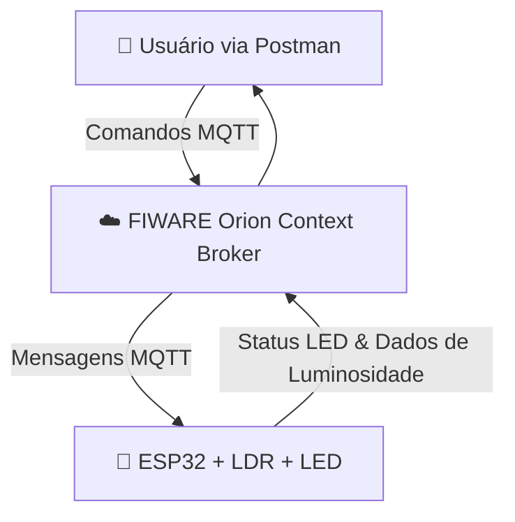

# 🍇 Vinheria Agnello – IoT com ESP32 + FIWARE + MQTT

## 📌 Visão Geral

Este projeto foi desenvolvido como parte de um estudo acadêmico, integrando **Internet das Coisas (IoT)**, **ESP32**, **MQTT** e a plataforma **FIWARE**. A ideia principal é demonstrar como a tecnologia pode contribuir para o monitoramento e controle de condições essenciais em uma vinheria, como a **luminosidade**, garantindo a preservação da qualidade dos vinhos.

---

## 🎯 Objetivo

* Criar uma integração entre **hardware (ESP32 + LDR + LED)** e **software (FIWARE + Postman)**.
* Monitorar a **luminosidade** em tempo real.
* Controlar o **LED onboard do ESP32** remotamente.
* Enviar dados para o **broker MQTT**, possibilitando a visualização e análise via **Postman**.

---
## 🔍 Importância do Projeto

🍷 O controle de luminosidade é vital na vinificação e armazenamento. Exposição incorreta à luz pode comprometer a qualidade do vinho, acelerando processos de oxidação. Este projeto ajuda a:

* Monitorar luminosidade em tempo real.

* Automatizar alertas e controles.

* Garantir a qualidade dos vinho.

---

## 🏗️ Arquitetura do Projeto

## 📸 Ilustração do Projeto

---

## 🔧 Componentes Utilizados

* **ESP32** (Wi-Fi + microcontrolador)
* **Sensor LDR** (leitura de luminosidade)
* **LED onboard do ESP32** (controle remoto)
* **Broker MQTT** (comunicação assíncrona)
* **FIWARE Orion Context Broker** (gerenciamento de contexto)
* **Postman** (testes e interação com a API)

---

## 📡 Tópicos MQTT

* **Subscrição (Receber comandos):** `lamp001/cmd`
* **Publicação (Status LED):** `lamp001/attrs`
* **Publicação (Luminosidade):** `lamp001/attrs/luminosidade`

---

## 🚀 Passo a Passo de Execução

1. **Criar VM no Azure** e instalar FIWARE.
2. **Clonar repositório base** https://github.com/fabiocabrini/fiware.git
3. **Configurar Postman** com as coleções fornecidas.
4. **Programar ESP32** com o código que:

   * Conecta ao **Wi-Fi**.
   * Conecta ao **broker MQTT**.
   * Lê a **luminosidade** via LDR e envia ao broker.
   * Recebe comandos via MQTT para **ligar/desligar** o LED.
   * Publica o **estado atual** do LED.
5. **Testar pelo Postman**:

   * Enviar comando para acender/apagar o LED.
   * Visualizar resposta no ESP32.
   * Acompanhar leitura do sensor em tempo real.

---

## 🖥️ Simulação no Wokwi

Este projeto também pode ser testado no https://wokwi.com/projects/441203962116738049 atravez desse link, utilizando:

* ESP32
* LDR

Basta importar o código e configurar o broker MQTT.

---

## 📘 Boas Práticas

* Utilizar tópicos bem estruturados no MQTT.
* Garantir reconexão automática em caso de falha no Wi-Fi ou broker.
* Normalizar valores de luminosidade (0–100%).
* Documentar endpoints utilizados no Postman.

---

## ⚠️ Possíveis Problemas

* **Conexão Wi-Fi** instável → verificar SSID e senha.
* **Broker MQTT inacessível** → checar IP e porta.
* **Dados não chegando ao Postman** → confirmar se o ESP32 está conectado ao FIWARE.

---

## ✅ Considerações Finais

Este projeto mostrou, de forma prática, como o **ESP32**, aliado ao **MQTT** e ao **FIWARE**, pode ser utilizado para criar soluções inteligentes em uma vinheria. A possibilidade de **monitorar a luminosidade em tempo real** e **controlar dispositivos remotamente** demonstra o potencial da IoT para preservar a qualidade dos vinhos e otimizar processos.

Mais do que uma aplicação acadêmica, essa arquitetura pode ser expandida para incluir outros sensores (temperatura, umidade, CO₂), tornando o sistema ainda mais robusto e confiável para o mercado vinícola.

---

👨‍💻 Desenvolvido por: \[Rafael Augusto Carmona, Eduardo Tolentino, Enzo Hort Ramos]

👩‍🏫Professor: Fabio Enrique Cabrini

📚 Curso: \[Engenharia de software] – \[Fiap]

🎥link do video no youtube do projeto: https://youtu.be/JP01_lkfRg8

⚙️link do meu projeto no wokwi: https://wokwi.com/projects/441203962116738049

